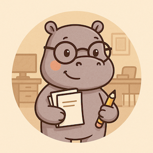
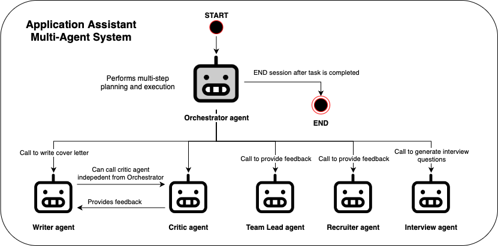
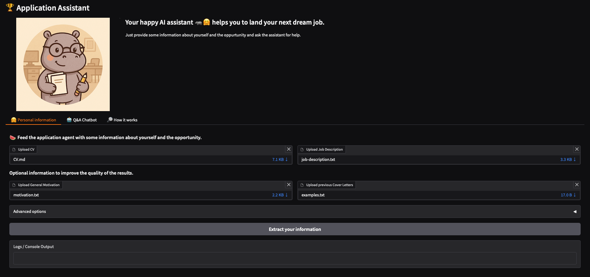

# 🏆 Application Assistant

### Submission for the: 🤖 Gradio Agents & MCP Hackathon 2025 🚀  
- **Track:** 3 – *Agentic Demo (agent-demo-track)*  
- **Author:** Fabian Hildebrandt

---

## 📌 Overview

**Application Assistant** 🦛🤗 is an intelligent, multi-agent application designed to support users throughout their job application journey.



This project demonstrates the power of **multi-agent collaboration** powered by **Gradio**’s UI framework and the **LangGraph**'s agent framework. 

Whether you're writing a compelling cover letter, preparing for an interview, or polishing your CV, **Application Assistant** is here to help.

## 🤖 What Can It Do?

- 📝 **Cover Letter Generator:** Draft, refine, and customize cover letters tailored to specific job roles.
- 🎤 **Interview Prep:** Simulate mock interview question sets and feedback.
- 👥 **Multi-Agent Collaboration:** Breaks down tasks into sub-tasks handled by specialized agents (e.g., Writer agent, critic agent, interview agent).


## 🧠 Multi-Agent System

The Application Assistant uses a modular agent system:




These agents communicate and collaborate via a central orchestrator.


## 🚀 Getting Started

### 🔧 Prerequisites
- Python installed
- `pip` installed
- OpenAI API key (or Google AI API key)

### 📥 Installation

```bash
git clone 
cd application-assistant
pip install -r requirements.txt
python app.py
```

---
## 🧭 Using the Tool

Once you've launched the app (by running `python app.py`), open your default browser and navigate to the Gradio interface at `http://localhost:7860`.



From there, you can:
1. **Input Your Details** such as job descriptions, existing CV and previous motivation letters and your general motivation.
2. **Interact with the Agents** using the Q&A Chatbot.
3. **Copy** your polished text or copy it directly for use in job applications.

The interface is designed to be intuitive, responsive, and ready to support you at any stage of your job application journey.

The app is also compatible with a Jupyter environment.